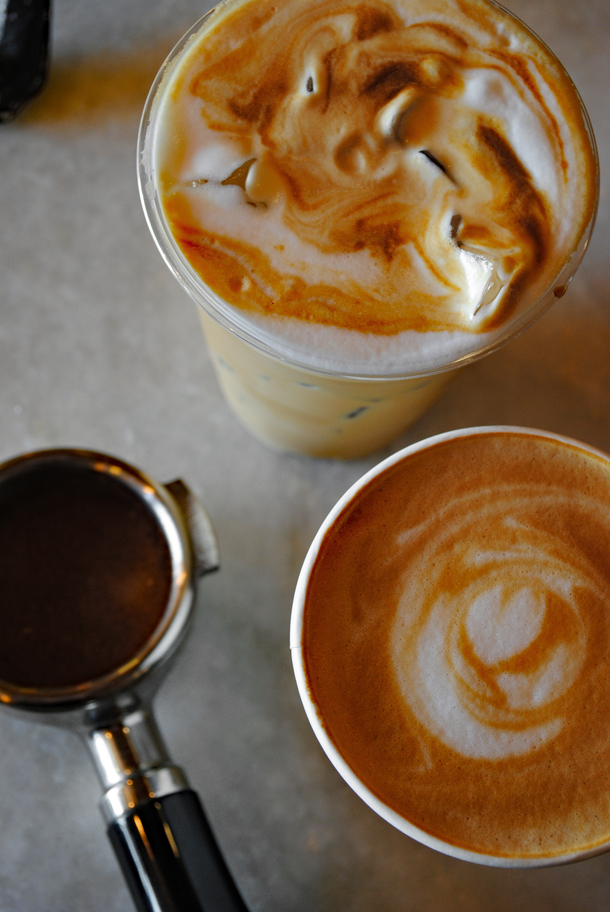

# Valo Website Revisions — Execution Plan

## Context

The Valo Coffee site (`/Users/brosiah/Git/Valo/`) currently runs as four pages — Home, Locations, Menu, Philosophy — with duplicated footer location cards, a single hero image, a separate full-menu page, and a separate philosophy page. The `valo_website_revisions_claude_code_brief.md` directs us to consolidate the site into a single-page experience: strip the top nav, surface the full menu without leaving the homepage, move philosophy onto the homepage, and reduce the footer to phone/email/copyright.

A lot of the brief's content work has already shipped (recent commits moved status lines, weekly hours, the Bean Menu label, the expanded Coffee section with cappuccino/flat white/cortado/espresso, the Optional flat list, removal of Jamaica, the Tasting Experience availability note at the top, the Coffee Beans copy, and the philosophy Q&A wording). What remains is structural: kill the multi-page experience, consolidate to one page, simplify the header and footer, and centralize menu data.

User decisions captured before planning:
- **Hero**: build the full carousel infrastructure this pass, but populate every slide with the existing hero image as a placeholder. Real images can be swapped in slide-by-slide later with no markup changes.
- **Full menu surface**: **modal** (focus-trapped, Escape-to-close, scroll-locked) opened from the homepage Menu section.
- **Legacy pages** (`locations.html`, `menu.html`, `philosophy.html`): replace each with a meta-refresh redirect to the corresponding homepage anchor. Preserves bookmarks/SEO equity, eliminates the fragmented experience.
- **Menu data**: centralize into `data/menu.json` now; render the modal menu from it via JS.

CLAUDE.md currently describes the four-page architecture and will need a v0.7 rewrite after this lands — flagged at the end of the plan as a follow-up, not done in this pass.

---

## Approach

One unified homepage. The header keeps only the brand mark. The Visit Valo cards and the Menu section stay where they are; the Menu section gets a "View full menu" button that opens the full menu in an accessible modal rendered from `data/menu.json`. The current "Coffee philosophy preview" section is replaced with the full philosophy content (lede + three `<details>` collapsibles), matching the wording already in `philosophy.html`. The footer collapses to phone, email, and copyright. The three legacy `.html` pages become 6-line redirect stubs. The Menu and FAQPage schema.org entities that lived on the deprecated pages migrate to `index.html` so structured-data coverage is preserved.

---

## File-by-file changes

### 1. `index.html` (major)

**Header nav** ([index.html:151-166](index.html#L151-L166)) — remove the three nav links and the `nav-toggle` hamburger button; the header reduces to the brand mark only. Keep `.site-header` / `.site-header-inner` wrappers so existing layout/spacing CSS still applies.

**Hero** ([index.html:172-188](index.html#L172-L188)) — build the carousel infrastructure. Replace the single `<picture>` with:
```html
<section class="hero home-hero">
  <div class="hero-carousel" data-carousel data-interval="6000">
    <ul class="hero-slides" data-slides>
      <li class="hero-slide is-active" aria-roledescription="slide" aria-label="1 of 3">
        <picture class="hero-media">
          <source media="(max-width: 760px)" srcset="assets/images/Coffee_look_mobile.jpeg" />
          <source media="(min-width: 761px)" srcset="assets/images/coffee_look_desktop.jpeg" />
          
        </picture>
      </li>
      <li class="hero-slide" aria-roledescription="slide" aria-label="2 of 3" aria-hidden="true">
        <picture class="hero-media">
          <source media="(max-width: 760px)" srcset="assets/images/Coffee_look_mobile.jpeg" />
          <source media="(min-width: 761px)" srcset="assets/images/coffee_look_desktop.jpeg" />
          
        </picture>
      </li>
      <li class="hero-slide" aria-roledescription="slide" aria-label="3 of 3" aria-hidden="true">
        <picture class="hero-media">
          <source media="(max-width: 760px)" srcset="assets/images/Coffee_look_mobile.jpeg" />
          <source media="(min-width: 761px)" srcset="assets/images/coffee_look_desktop.jpeg" />
          
        </picture>
      </li>
    </ul>
  </div>
  <div class="hero-overlay" aria-hidden="true"></div>
  <div class="container hero-content">
    <h1 class="hero-headline">The best coffee in Arizona</h1>
    <p class="hero-sub">Open daily</p>
    <div class="button-row">
      <a class="button" href="#today">Visit Valo</a>
      <a class="button button-secondary" href="#menu">See the menu</a>
    </div>
  </div>
</section>
```
Notes:
- Each slide uses the same image while it's a placeholder. Distinct alt text describes the eventual subject so a screen-reader user gets useful context now and the alt text stays correct when real images drop in slot-by-slot.
- `width`/`height` on the `` preserves the existing aspect ratio and prevents layout shift.
- Only slide 1 is `loading="eager" fetchpriority="high"`; slides 2+ are `loading="lazy"`. The existing `<link rel="preload">` in `<head>` continues to apply (one image, three slides referencing it).
- No visible controls (dots, prev/next) in v1 — the brief doesn't require them and rotating through identical images with visible dots would look broken. When real images get swapped in, add dots in the same `.hero-carousel` block.

Rename the two CTA buttons in `.hero-content`: "View locations" → **"Visit Valo"**, "View menu" → **"See the menu"**. Hrefs stay (`#today`, `#menu`).

**Visit Valo** ([index.html:191-235](index.html#L191-L235)) — content unchanged. Add `id="curbside"` and `id="resort"` to the two `.today-card` `<article>` elements so the schema.org URLs (`#curbside`, `#resort`) resolve to real anchors on the homepage. The two "View menu" buttons inside the cards already point at `#menu` and continue to scroll to the Menu section.

**Menu preview** ([index.html:237-275](index.html#L237-L275)) — replace the `<a class="button button-secondary" href="menu.html">View full menu</a>` with `<button class="button button-secondary" type="button" data-menu-open>View full menu</button>`. The simplified two-column preview (Coffee + Beans) stays as today's static HTML — the modal is the only thing JS-rendered.

**Philosophy section** ([index.html:277-289](index.html#L277-L289)) — replace the current short "A simpler menu" preview with the full philosophy content lifted from `philosophy.html`:
- Eyebrow: `Our Approach`
- Opening lede paragraph from brief §12: *"Every drink on our menu is made with pure, raw ingredients. We do not add anything else, so the bean's naturally occurring flavors can be enjoyed clearly."*
- "What is coffee?" question + answer (matches existing philosophy.html)
- Three `<details class="philosophy-detail">` collapsibles, in order: "Where do the tasting notes come from?", "Why is the menu so simple?", "How do we make espresso?" — copy verbatim from [philosophy.html:131-150](philosophy.html#L131-L150)
- Drop the "Read our philosophy" link entirely (philosophy is now here)
- Reuse the existing CSS classes (`.philosophy-detail`, `.philosophy-detail-body`, `.philosophy-body`, `.philosophy-lede`, `.eyebrow`) so no new styles are needed for this section

**Modal markup** — append a hidden modal container at the end of `<main>` (before `</main>`):
```html
<div class="menu-modal" id="menu-modal" role="dialog" aria-modal="true" aria-labelledby="menu-modal-title" hidden>
  <div class="menu-modal-backdrop" data-menu-close></div>
  <div class="menu-modal-card" role="document">
    <div class="menu-modal-header">
      <h2 id="menu-modal-title" class="eyebrow">Full menu</h2>
      <button class="menu-modal-close" type="button" aria-label="Close menu" data-menu-close>
        <svg viewBox="0 0 24 24" ...>X icon</svg>
      </button>
    </div>
    <div class="menu-modal-body" data-menu-body>
      <!-- Rendered by menu.js from data/menu.json. Fallback content (the full static menu from menu.html) sits here as a no-JS safety net. -->
    </div>
  </div>
</div>
```

**Footer** ([index.html:293-327](index.html#L293-L327)) — replace the entire `.footer-grid` + `.footer-bottom` block with the brief §14 format:
```html
<div class="footer-simple">
  <a href="tel:+19289106087">928-910-6087</a>
  <a href="mailto:support@valocoffee.com">support@valocoffee.com</a>
  <span>&copy; Valo Coffee</span>
</div>
```

**Schema.org JSON-LD** ([index.html:41-141](index.html#L41-L141)) — make four sets of edits:
1. Update both `CafeOrCoffeeShop.url` values from `/locations.html#curbside|resort` to `/#curbside|resort`.
2. Update both `CafeOrCoffeeShop.hasMenu` values from `/menu.html` to `/#menu`.
3. **Add the `Menu` entity** (previously in menu.html) to the `@graph` array, including all six MenuSections (Coffee, Bean Menu, Not coffee, Tasting experience, Coffee beans) with their existing MenuItems and prices — lifted verbatim from [menu.html:38-162](menu.html#L38-L162). Update `@id` to `https://valocoffee.com/#menu`.
4. **Add the `FAQPage` entity** (previously in philosophy.html) to the `@graph` array — the four `mainEntity` Question/Answer pairs from [philosophy.html:38-88](philosophy.html#L38-L88) match the new on-page philosophy content exactly.

**Scripts** — add `<script src="assets/js/carousel.js?v=1" defer></script>` and `<script src="assets/js/menu.js?v=1" defer></script>` after the existing status.js include.

### 2. `philosophy.html` → redirect stub

Replace the entire file with:
```html
<!DOCTYPE html>
<html lang="en">
<head>
  <meta charset="UTF-8" />
  <meta http-equiv="refresh" content="0; url=/#philosophy" />
  <link rel="canonical" href="https://valocoffee.com/" />
  <meta name="robots" content="noindex" />
  <title>Valo Coffee</title>
</head>
<body>
  <p>Redirecting to <a href="/#philosophy">Valo Coffee</a>.</p>
</body>
</html>
```

### 3. `locations.html` → redirect stub

Same shape as above, redirecting to `/#today` (the existing Visit Valo anchor id).

### 4. `menu.html` → redirect stub

Same shape, redirecting to `/?menu=full#menu`. The `?menu=full` query is read by `menu.js` to auto-open the modal so the deep link still lands a visitor on the full menu.

### 5. `data/menu.json` (new file)

Centralized menu data lifted from [menu.html:198-290](menu.html#L198-L290). Structure:
```json
{
  "coffee": {
    "label": "Coffee",
    "items": [
      { "name": "latte", "price": "7" },
      { "name": "coffee", "price": "5" },
      { "name": "cappuccino", "price": "7", "options": "traditional or extra milk" },
      { "name": "flat white", "price": "7", "options": "traditional or extra milk" },
      { "name": "cortado", "price": "5–7", "options": "traditional or extra milk" },
      { "name": "espresso", "price": "5" }
    ]
  },
  "beans": {
    "label": "Bean Menu",
    "note": "Each tasting note listed here is naturally occurring in the bean. Nothing has ever been added to the coffee beans.",
    "items": [
      { "name": "dark & smoky", "origin": "colombia" },
      { "name": "peanut butter", "origin": "brazil" },
      { "name": "peach", "origin": "colombia" },
      { "name": "strawberry", "origin": "honduras" },
      { "name": "apple spice", "origin": "colombia" },
      { "name": "decaf", "origin": "mexico" }
    ]
  },
  "optional": {
    "label": "Optional",
    "items": ["vanilla", "mocha", "caramel", "sugar", "brown sugar", "honey", "maple", "splenda", "stevia"]
  },
  "notCoffee": {
    "label": "Not coffee",
    "items": [
      { "name": "cocoa latte", "price": "5" },
      { "name": "chai latte", "price": "7" },
      { "name": "matcha latte", "price": "7" },
      { "name": "ube latte", "price": "7" },
      { "name": "golden latte", "price": "7" },
      { "name": "butterfly lemonade", "price": "7" },
      { "name": "hibiscus yuzu", "price": "7" }
    ]
  },
  "tasting": {
    "label": "Tasting experience",
    "availability": "Tasting experiences are available at Valo Sit-Down only.",
    "items": [
      { "name": "coffee tasting experience", "price": "19", "desc": "Four coffees of your choice, served as a pour-over flight, then any full-size drink from the menu." },
      { "name": "not coffee tasting experience", "price": "19", "desc": "Four not coffee lattes of your choice, served as a sample flight, then any full-size drink from the menu." }
    ]
  },
  "beansForSale": {
    "label": "Coffee beans",
    "sublabel": "half pound bag",
    "items": [
      { "name": "dark & smoky", "price": "22" },
      { "name": "peanut butter", "price": "22" },
      { "name": "peach", "price": "22" },
      { "name": "strawberry", "price": "22" },
      { "name": "apple spice", "price": "22" },
      { "name": "decaf", "price": "22" }
    ],
    "note": "Available at both locations. For custom grinding and vacuum sealing, visit Valo Sit-Down."
  }
}
```

### 6a. `assets/js/carousel.js` (new file)

Vanilla JS, ~60 lines. Responsibilities:
- For each `[data-carousel]`: read `data-interval` (ms, default 6000), find all `[data-slides] > li.hero-slide`.
- If only one slide exists or `prefers-reduced-motion: reduce` matches, do nothing — leave the first slide visible and skip auto-rotation.
- Otherwise, every `interval` ms, advance the active slide: remove `is-active` and add `aria-hidden="true"` to the current slide; add `is-active` and remove `aria-hidden` from the next; wrap from last → first.
- Pause auto-rotation when the carousel is hovered or focused (`mouseenter`/`focusin` → clearInterval; `mouseleave`/`focusout` → restart).
- Pause when the tab is hidden (`document.visibilitychange`) so the timer doesn't fire offscreen and waste cache lifetime.

No public controls in v1. The CSS handles the crossfade; the JS just toggles `is-active`.

### 6b. `assets/js/menu.js` (new file)

Vanilla JS, ~120 lines. Responsibilities:
- On `DOMContentLoaded`: `fetch('/data/menu.json')`, render the modal body's HTML into `[data-menu-body]` using the same `.menu-card`/`.menu-section-block`/`.paper-menu` class structure that menu.html uses today (so the existing CSS in `styles.css` styles it identically — no duplicate styling work).
- If fetch fails, leave the static fallback markup alone (the no-JS content is already a complete menu).
- Wire `[data-menu-open]` clicks to open the modal: remove `hidden`, add `body.menu-modal-open` (locks scroll via CSS), focus the close button, snapshot the previously-focused element.
- Wire `[data-menu-close]` clicks (close button + backdrop) and `keydown Escape` to close: add `hidden`, remove the body class, restore focus to the snapshotted opener.
- Implement a simple focus trap: on `keydown Tab` while open, cycle focus among the modal's tabbable elements (`button`, `a[href]`, `[tabindex]:not([tabindex="-1"])`).
- On load, if `new URLSearchParams(location.search).get('menu') === 'full'`, programmatically open the modal (deep-link from `menu.html` redirect). Hash `#menu` already scrolls the page so the Menu section sits behind the modal when closed.

Static HTML fallback content inside `[data-menu-body]` ensures the modal still shows the menu if JS fails or `data/menu.json` 404s — copy the same markup currently in [menu.html:196-292](menu.html#L196-L292) verbatim.

### 7. `assets/css/styles.css` (additions)

**Hero carousel:**
- `.hero-carousel` — `position: absolute; inset: 0` inside `.hero` (matches today's `.hero-media` positioning). Slides stack absolutely on top of each other.
- `.hero-slides` — list reset (`list-style: none; margin: 0; padding: 0`), `position: absolute; inset: 0`.
- `.hero-slide` — `position: absolute; inset: 0`, `opacity: 0`, `transition: opacity 800ms ease`. Each slide has the same `width`/`height: 100%`.
- `.hero-slide.is-active` — `opacity: 1`.
- `.hero-slide picture, .hero-slide img` — fill the slide (`width: 100%; height: 100%; object-fit: cover`) so the existing `.hero` height drives layout. This replaces what `.hero-media` did on the single `<picture>` today.
- `@media (prefers-reduced-motion: reduce) { .hero-slide { transition: none; } }` — no fade animation for users who opted out. Combined with the JS check (no rotation at all when reduced motion is requested), the hero is effectively static for those visitors.

**Menu modal:**
- `.menu-modal` — `position: fixed`, full viewport, `z-index: 100`, `display: flex`, items centered. Hidden via the `[hidden]` attribute (no extra rule needed).
- `.menu-modal-backdrop` — absolute fill, `background: rgba(0,0,0,0.7)`.
- `.menu-modal-card` — white, `max-width: 880px`, `width: calc(100% - var(--space-6))`, `max-height: 90vh`, `overflow-y: auto`, `border-radius: 2px` (CLAUDE.md §4 ceiling), centered, `position: relative` (above backdrop), spacing tokens for inner padding.
- `.menu-modal-header` — `position: sticky; top: 0`, white background, flex row with the title eyebrow on the left and the close button on the right, thin bottom border.
- `.menu-modal-close` — 44×44 button (CLAUDE.md tap-target rule), no pill shape, just an X icon. Border: none. `touch-action: manipulation`.
- `body.menu-modal-open { overflow: hidden; }` to lock background scroll.
- `.footer-simple` — single horizontal row at desktop with `gap: var(--space-5)`, stacks vertically below 600px (`flex-direction: column` in a media query). Centered. Reuses existing footer link colors.
- Mobile sizing for the modal card (<600px): `max-width: 100%`, `max-height: 100vh`, no border-radius, fills viewport. Sticky header still works.

Header tweaks: leave the `.nav-toggle` and `.site-nav` CSS rules in place — they're orphaned but harmless and small. (Optional follow-up: prune them after this lands.)

### 8. `sitemap.xml`

Drop the `<url>` entries for `/locations.html`, `/menu.html`, `/philosophy.html` (they're now redirects). Keep `/` and `/404.html`. Bump `<lastmod>` on the homepage entry to today.

### 9. `404.html` (small touch)

Quick read-only check during implementation: if the 404 page has the same multi-link nav as the old pages, strip it to match the new brand-only header. If it's already minimal, no change needed.

---

## Mapping to brief §17 acceptance criteria

| Brief criterion | Where it's satisfied |
| --- | --- |
| Homepage has a hero image carousel | §1 Hero refactor + §6a carousel.js. Three slides with placeholder content (same image, distinct alt text); real images swap in later by replacing srcset values slot-by-slot. |
| Top nav no longer shows Locations, Menu, Philosophy | §1 header refactor in index.html |
| Homepage uses **Valo Curbside** and **Valo Sit-Down** | Already done; preserved through refactor |
| Each location card shows useful current status + full weekly hours | Already done (status.js); preserved |
| Full menu no longer uses "pick" or "choose" labels | Already done in menu.html; data/menu.json carries the clean labels |
| Coffee includes latte, coffee, cappuccino, flat white, cortado, espresso | Already done in menu.html; preserved in menu.json |
| Cappuccino and flat white include "Traditional or extra milk" | Already done; preserved in menu.json |
| Bean section labeled **Bean Menu** | Already done; preserved in menu.json |
| Bean note says nothing has ever been added | Already done; preserved in menu.json |
| Jamaica removed from Not Coffee | Already done; preserved in menu.json |
| Tasting Experience availability appears at top, names Valo Sit-Down only | Already done in menu.html; preserved in menu.json |
| Coffee Beans custom grinding copy refers to Valo Sit-Down | Already done; preserved in menu.json |
| Philosophy is part of the homepage | §1 philosophy section work in index.html |
| "How do we make the perfect drink?" removed | Already done in philosophy.html; preserved when moved to homepage |
| Footer only contains phone, email, copyright | §1 footer refactor |
| No duplicate location block in footer | §1 footer refactor |
| Full menu navigation no longer creates awkward separate-page flow | §6 modal, §4 menu.html redirect stub |

---

## What is NOT changing in this pass

- The single hero image asset (the carousel infrastructure goes in, but every slide uses the existing image until real images are sourced).
- The existing `assets/js/status.js` and `data/locations.json` — already correct.
- The visual paper-menu styling — the modal reuses the same classes so the look stays identical.
- The Visit Valo card content/copy.
- CLAUDE.md — will need a v0.7 rewrite to match the new single-page architecture, but that's a follow-up after this work merges, not part of this plan.

---

## Verification

After implementation, with the dev server running (`python3 -m http.server 8000` from the repo root) and the page opened in a browser at `http://localhost:8000/`:

1. **Header**: only the Valo brand mark visible. No nav links, no hamburger.
2. **Hero**: three slides render in the carousel. Auto-rotation crossfades between them every ~6s (visually a no-op while all three are the same image — verify by inspecting the DOM that `is-active` moves through the three `<li>` slides). Hover/focus pauses rotation. The "Visit Valo" button scrolls to the Visit Valo cards; "See the menu" scrolls to the Menu section. Both location cards show the status line + full weekly hours (driven by `status.js` against `data/locations.json`).
   - **Reduced motion**: in System Settings (macOS Accessibility) or DevTools (Rendering → Emulate CSS media feature `prefers-reduced-motion: reduce`), confirm the carousel stops cycling and the fade transitions are disabled.
3. **Menu section**: simplified Coffee + Beans preview visible. Clicking "View full menu" opens the modal.
4. **Modal behavior**:
   - Background scroll locked while open.
   - `Escape` closes the modal.
   - Close button (X) closes the modal.
   - Backdrop click closes the modal.
   - Focus returns to the "View full menu" button after close.
   - Tab cycles only inside the modal while open.
   - Full menu content matches `menu.html` today (Coffee, Bean Menu, Optional, Not coffee, Tasting experience, Coffee beans).
5. **Philosophy on homepage**: scroll to the "Our Approach" section. Lede paragraph + "What is coffee?" + three collapsibles (closed by default). Clicking each `<summary>` expands it. No "How do we make the perfect drink?" section anywhere.
6. **Footer**: only phone, email, copyright. No location cards, no addresses, no hours, no "Get directions", no "Prescott, Arizona".
7. **Legacy redirects**: visit `http://localhost:8000/locations.html`, `/menu.html`, `/philosophy.html` directly. Each should redirect to `/#today`, `/?menu=full#menu`, and `/#philosophy` respectively (within a fraction of a second).
8. **Menu deep-link**: `/?menu=full#menu` should auto-open the modal on landing.
9. **No-JS sanity check**: disable JS in DevTools, reload. The static menu preview, philosophy collapsibles (native `<details>`), and Visit Valo cards (with hardcoded fallback hours from index.html) should all still render. The modal won't open, but the fallback static menu inside `[data-menu-body]` means there's still a readable menu in the DOM. (Redirect stubs use `<meta http-equiv="refresh">`, which works without JS.)
10. **Accessibility**:
    - Tab through the homepage and confirm focus order is logical with the nav stripped.
    - Open the modal with a keyboard (Tab to the button, Enter), confirm focus moves to the close button.
    - VoiceOver/screen-reader: modal announces as a dialog with the "Full menu" label.
11. **Mobile (375px width via DevTools)**: header still looks clean without nav. Modal fills the viewport without horizontal scroll. Philosophy collapsibles stack cleanly. Footer items stack vertically.
12. **Visual regression**: compare against current production homepage — Visit Valo cards, menu preview content, and overall typography should look unchanged. Only the header, the footer, and the philosophy section should look different.
13. **Schema validation**: paste `index.html` source into [Google's Rich Results Test](https://search.google.com/test/rich-results) — should detect Organization, WebSite, two CafeOrCoffeeShop entries, one Menu, and one FAQPage with no errors.

---

## Critical files

- [index.html](index.html) — major refactor (header, menu modal trigger, philosophy section, footer, schema, scripts)
- [locations.html](locations.html), [menu.html](menu.html), [philosophy.html](philosophy.html) — replaced with redirect stubs
- [data/menu.json](data/menu.json) — new
- [assets/js/carousel.js](assets/js/carousel.js) — new
- [assets/js/menu.js](assets/js/menu.js) — new
- [assets/css/styles.css](assets/css/styles.css) — hero carousel + modal + footer-simple additions
- [sitemap.xml](sitemap.xml) — trim redirected URLs
- [404.html](404.html) — header check, strip nav if present

## Follow-ups (not in this pass)

- Rewrite `CLAUDE.md` from v0.6 (four-page architecture) to v0.7 (single-page architecture). It contradicts the new structure in §3 (Per-page nav rule), §5 (Pages list and Homepage sections), and §8 (Required head tags per page).
- Source the additional hero images (curbside handoff, sit-down/tasting, Prescott Resort view, beans/tasting flight, etc.) and swap them into slides 2 and 3 of the carousel — replace the `srcset`/`src` values, update alt text if needed. Consider adding slide indicators (dots) once the slides differ visually.
- Prune dead `.nav-toggle` and `.site-nav` CSS rules once it's clear no consumer (e.g., a future page that brings nav back) needs them.

---

## Execution order (suggested commit boundaries)

Each commit below is self-contained and shippable. The order is chosen so that no commit visibly breaks the site for visitors — the homepage works at every step, and the legacy pages keep working until the very last commit replaces them with redirects.

1. **Add `data/menu.json`** — pure data file, no behavior change. Smoke-test by hand-validating the JSON.
2. **Add the menu modal: markup + CSS + JS** — append modal markup at the end of `index.html`'s `<main>`, add `.menu-modal*` rules to `styles.css`, add `assets/js/menu.js`, swap the homepage "View full menu" link for the `<button data-menu-open>`. Test: modal opens, closes (X, Escape, backdrop), focus is trapped, body scroll locks, deep-link `?menu=full` auto-opens. The link to `menu.html` no longer fires from the homepage, but `menu.html` itself still works for anyone who lands on it.
3. **Convert hero to carousel** — replace the single `<picture>` with the three-slide structure, add `assets/js/carousel.js`, add `.hero-carousel/.hero-slide` rules to `styles.css`, rename the two CTA labels. Test: slides rotate via `is-active` toggling; pause on hover/focus; `prefers-reduced-motion` stops rotation.
4. **Move philosophy onto the homepage** — replace the short "A simpler menu" section in `index.html` with the full philosophy content (lede + What is coffee? + three collapsibles). Test: section renders, collapsibles expand/collapse, no visual regression elsewhere.
5. **Strip header nav + simplify footer in `index.html`** — remove the three nav links + nav-toggle button, replace the footer grid with `.footer-simple`. Test: header shows only the brand, footer shows only phone/email/copyright, all in-page anchors still scroll correctly.
6. **Update schema.org in `index.html`** — fix the two `CafeOrCoffeeShop.url` and `hasMenu` values, add the `Menu` entity, add the `FAQPage` entity. Validate with Google Rich Results Test.
7. **Replace the three legacy pages with redirect stubs** — `locations.html` → `/#today`, `menu.html` → `/?menu=full#menu`, `philosophy.html` → `/#philosophy`. Test each old URL still leads the visitor to the right homepage section.
8. **Trim `sitemap.xml`** + check `404.html` nav — drop the three redirected URLs, bump `<lastmod>` on `/`. If `404.html` still has multi-page nav, strip it.

Commits 1–4 stand alone; commit 5 is bundled with the structural work but could be its own commit if preferred; commits 6–7 wrap up legacy URLs and discoverability. Ship as one PR or split — the work isn't large enough to need splitting.

---

## Edge cases & risks

- **Hash-preserving redirects**: `<meta http-equiv="refresh" content="0; url=/#today">` reliably preserves the hash in modern browsers. If a browser strips it, the visitor still lands on the homepage — degraded but not broken. Add an inline `<script>location.replace('/#today')</script>` after the meta tag for an extra layer of safety (`replace` does not add a back-button entry).
- **`?menu=full` deep-link**: when `menu.html` redirects to `/?menu=full#menu`, the browser scrolls to `#menu` *and* `menu.js` opens the modal on load. The modal sits over the Menu section, so closing it leaves the visitor at the right scroll position. Test the `Esc → close → back button` flow to make sure the URL doesn't accumulate junk (we're not pushing state to history, so it shouldn't).
- **Modal fallback when JS fails**: the static menu markup inside `[data-menu-body]` ensures crawlers and no-JS visitors see the menu content. But without JS, the `[data-menu-open]` button does nothing visible. Mitigation: keep the simplified preview meaningful (it already lists drinks + beans + prices), and accept that the full menu is JS-gated for no-JS visitors. SEO is fine because the JSON-LD `Menu` entity carries the complete data.
- **Schema.org duplication risk**: the `Menu` and `FAQPage` entities will only live on `index.html` after the legacy pages become redirect stubs (which have no schema). No risk of Google seeing two copies.
- **Skip-link target**: the `<a class="skip-link" href="#main">` still works — `<main id="main">` is unchanged.
- **`status.js` selectors**: `status.js` reads `[data-status-headline]` and `[data-status-hours]` inside `.today-card[data-location]`. Adding `id="curbside"`/`id="resort"` to the same articles doesn't conflict. Tested mentally; will verify after wiring.
- **Mobile viewport on iOS**: `100vh` on iOS Safari includes the dynamic toolbar area, so `max-height: 90vh` may be too tall. Use `max-height: min(90vh, 90dvh)` if dynamic viewport units render correctly; fall back to `90vh` for older Safari.
- **Reduced motion**: the modal uses no animations beyond browser default. The carousel respects `prefers-reduced-motion` two ways (no auto-rotation in JS; no fade transition in CSS).
- **Multiple modal opens**: clicking the trigger while the modal is already open is a no-op; the JS should guard against re-attaching focus traps. Implementation note for `menu.js`.
- **Carousel placeholder phase**: while all three slides reference the same image, the rotation is invisible to visitors. Verified-broken behavior would only appear if dots were rendered (visitors would see dots cycling on a static image). Plan avoids this by omitting dots until slides differ. Auto-rotation still runs so the mechanism is exercised in production from day one.
- **Hero preload tag**: the `<link rel="preload" as="image">` tags in `<head>` currently point at the desktop/mobile sources. Since slide 1's `` is `loading="eager" fetchpriority="high"` and references the same files, the preload still hits. No `<head>` changes required for the carousel.

---

## Locked-in copy decisions

- **Philosophy section eyebrow**: **"Our Approach"**.
- **Hero CTA labels**: **"Visit Valo"** (→ `#today`) and **"See the menu"** (→ `#menu`).
- **Modal title eyebrow**: **"Full menu"**.
- **Modal close button**: X icon button, 44×44, in the upper-right of the modal header.

---

## `assets/js/menu.js` skeleton

Concrete shape so the implementation has no ambiguity:

```js
(function () {
  const modal = document.getElementById('menu-modal');
  if (!modal) return;
  const body = modal.querySelector('[data-menu-body]');
  const openers = document.querySelectorAll('[data-menu-open]');
  const closers = modal.querySelectorAll('[data-menu-close]');
  let lastFocused = null;

  // 1. Fetch menu data and render into the modal body (replaces no-JS fallback markup).
  fetch('/data/menu.json')
    .then((r) => (r.ok ? r.json() : Promise.reject()))
    .then((data) => { body.innerHTML = renderMenu(data); })
    .catch(() => { /* keep static fallback markup */ });

  function renderMenu(data) {
    // Returns a string of HTML matching the .menu-card / .menu-section-block / .paper-menu
    // structure currently in menu.html, so existing styles in styles.css apply unchanged.
    // Sections in order: coffee, beans (inside the coffee section), optional (inside the
    // coffee section), notCoffee, tasting, beansForSale.
  }

  function openModal() {
    if (!modal.hasAttribute('hidden')) return; // guard against double-open
    lastFocused = document.activeElement;
    modal.removeAttribute('hidden');
    document.body.classList.add('menu-modal-open');
    modal.querySelector('.menu-modal-close').focus();
    document.addEventListener('keydown', onKeydown);
  }

  function closeModal() {
    if (modal.hasAttribute('hidden')) return;
    modal.setAttribute('hidden', '');
    document.body.classList.remove('menu-modal-open');
    document.removeEventListener('keydown', onKeydown);
    if (lastFocused && typeof lastFocused.focus === 'function') lastFocused.focus();
  }

  function onKeydown(e) {
    if (e.key === 'Escape') { e.preventDefault(); closeModal(); return; }
    if (e.key === 'Tab') trapFocus(e);
  }

  function trapFocus(e) {
    const focusables = modal.querySelectorAll(
      'a[href], button:not([disabled]), [tabindex]:not([tabindex="-1"])'
    );
    if (!focusables.length) return;
    const first = focusables[0];
    const last = focusables[focusables.length - 1];
    if (e.shiftKey && document.activeElement === first) { e.preventDefault(); last.focus(); }
    else if (!e.shiftKey && document.activeElement === last) { e.preventDefault(); first.focus(); }
  }

  openers.forEach((b) => b.addEventListener('click', openModal));
  closers.forEach((b) => b.addEventListener('click', closeModal));

  // Deep-link from menu.html redirect: ?menu=full auto-opens.
  if (new URLSearchParams(location.search).get('menu') === 'full') openModal();
})();
```

`renderMenu()` builds the same structure that exists in `menu.html` today — six `<section class="menu-section-block">` blocks wrapped in a `<article class="menu-card menu-card-warm paper-menu-card">`. The Coffee section nests the Bean Menu and Optional columns inside `.paper-menu` like the current page does.
